# refine

refine turns software gaps: new apps, features, and bugs into verified changes
by coordinating people and agents across distributed machines, while keeping
feedback cheap, local, and repeatable. QA, Product, support, customers — anyone
who can articulate *what the app does today* vs *what it should do instead* —
submits a Gap.

- **Local ownership** - each instance owns its queue and data locally, while git keeps people in sync across machines without central infrastructure.
- **Cheap feedback loops** - Gaps move from report to agent work to human review, so the system improves through fast correction instead of perfect upfront specification.
- **Planning and chat** - people can think with agents before execution, ask questions, and steer Gap-specific follow-up.
- **Quality automation** - Guidance, Governance, and QA shape agent work from planning through merge, keeping automation aligned with product intent, local rules, and requirements.
- **Human verification** - people review the result before merge, preserving ordinary human judgment where it matters.
- **Operational continuity** - refine works inside existing repositories, branches, processes, and development practices.

## Quick Start

Linux, macOS, or Ubuntu/WSL:

```bash
curl -fsSL https://raw.githubusercontent.com/buwilliams/refine/main/install.sh | bash
```

The installer checks the host, installs or repairs missing tools when you approve,
asks which AI provider to use, optionally clones or attaches the target
application, and starts Refine.

If your security policy blocks piped scripts, download and inspect it first:

```bash
curl -fsSLO https://raw.githubusercontent.com/buwilliams/refine/main/install.sh
bash install.sh
```

### Windows Users

Open PowerShell as Administrator:

```powershell
wsl --install
```

After Ubuntu opens, run the same Refine installer:

```bash
curl -fsSL https://raw.githubusercontent.com/buwilliams/refine/main/install.sh | bash
```

Use `uv run refine install [port]` for a persistent system service that runs as the installing user and may prompt for sudo; `start [port]` runs a non-installed background process.

## Workflow

1. A person adds a Gap; it starts in the Backlog.
2. A person or automation moves the Gap to the Todo list when it is ready for work.
3. Guidance adds matched instructions; Governance validates the request.
4. AI agents work Todo Gaps in parallel.
5. People review the result; if it misses the target, they submit another Round.
6. Approval closes the Gap.

## Mental Model

- refine is a development tool installed on a dev or QA machine.
- Use it as a solo contributor or open it up to a group.
- Each machine has its own instance, configured manually.
- refine supports multiple layers: processes on one host at different ports, targeted applications as data boundaries, and device instances on the same targeted application.
- All data is owned by an instance and synced through git.
- Governance and Guidance are global across all instances.



## License

[MIT](LICENSE) — use it however you like, modify it, ship it, sell it. No
warranty, no support obligations on my end. If you build something useful
on top, a heads-up is appreciated but not required.
