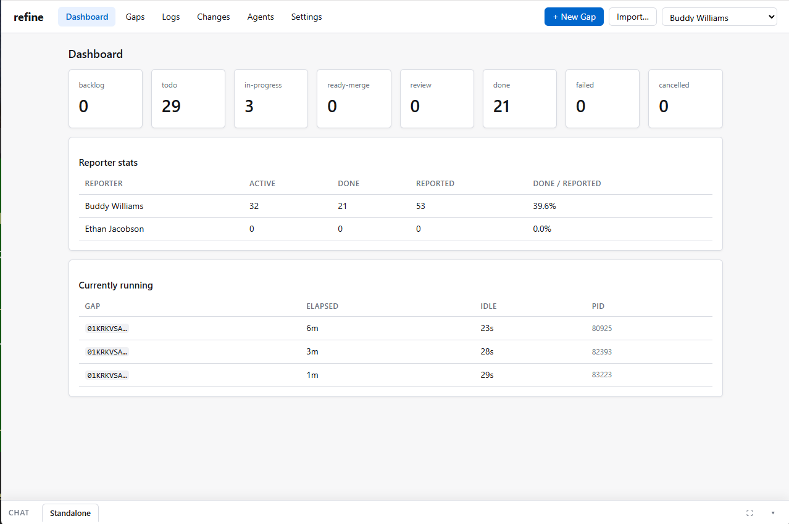
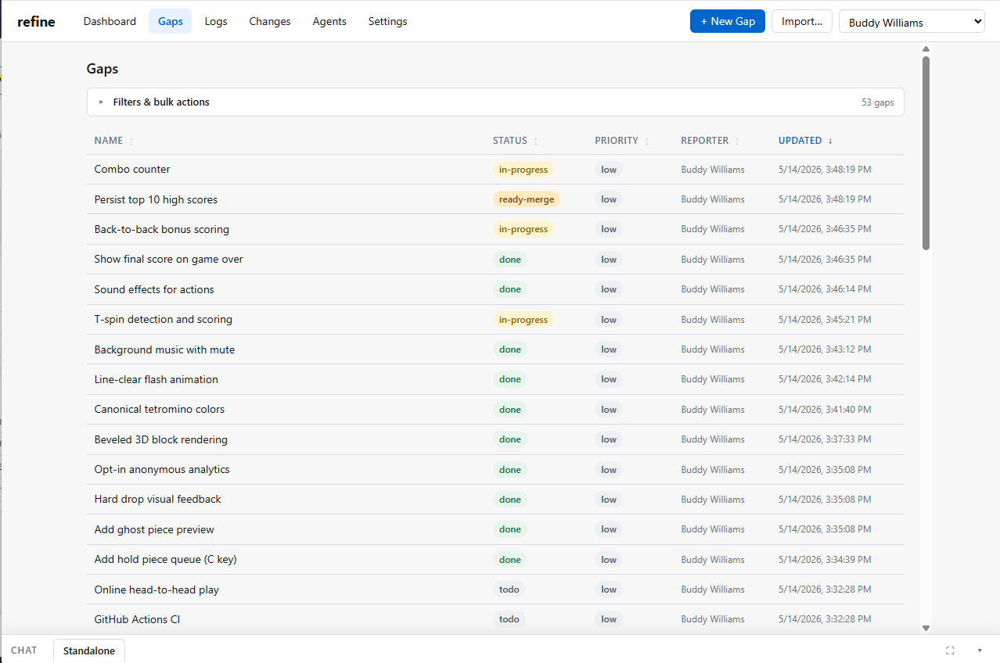

# refine



Refine turns software gaps (features and bugs) into verified software
through ordinary people enhanced by agents. QA, Product, support,
customers — anyone who can articulate *what the app does today* vs
*what it should do instead* — submits a Gap. New Gaps land in
**backlog**, then move to **todo** either when someone promotes them or when
the Settings auto-promote rule fires (default: 1 hour). From there refine
launches the configured agent CLI in a git worktree to close it; a human
reviews the diff and the live behavior;
only after that review does **verify** merge the work to the
configured target branch and push. Gaps move
`backlog → todo → in-progress → review → done`, with `failed` and
`cancelled` for the unhappy paths; multiple Gaps run in parallel up
to a configurable cap.

You drive everything from a web UI:

- A **status dashboard** with a Reporter stats card — click a row to deep-link
  into the Gaps list filtered by that reporter.
- A **Gaps list** with search + status + reporter + severity / category / actor
  / entries-limit filters, sortable columns, and bulk-update actions for
  priority, status, and reporter that respect whatever filter is active.
- A **filterable Logs view** with the same Logs-style filter set.
- A **persistent Chat dock** at the bottom of every page — collapsible,
  vertically resizable, with a fullscreen toggle. Tabs for a standalone chat
  and one per Gap; opening Chat against an in-progress Gap eagerly primes the
  agent session with the Gap's context so the user's first message gets a
  context-aware answer. Transcripts render markdown.
- Import-from-text uses an **LLM call** (via the selected host agent CLI) to extract
  `{name, actual, target}` drafts from free-form paste-dumps; a loading
  indicator shows while the model runs.

Active filters are surfaced visually: matching dropdowns/inputs pick up an
accent border, a "FILTERED" pill appears next to the count, and the results
table grows an accent stripe + tinted header.



Refine handles the git plumbing — worktrees, fetch, merge, push,
auto-committing its own state — and inherits the selected agent CLI's host
auth, so operators rarely need to think about either.

## Components

- **`refine_ui`** — host-native Python backend (UI + JSON API + SSE) that
  owns the runner in-process.
- **`refine_server`** — backend component that owns CLI subprocesses, git
  operations, and `gap.json` writes. It runs inside the UI process in normal
  operation, so it inherits the host's agent auth, SSH keys, and git config.
  Agent subprocesses additionally strip
  provider API-key override vars such as `ANTHROPIC_API_KEY`,
  `CLAUDE_API_KEY`, and `OPENAI_API_KEY`, then resolve CLIs via the user's
  interactive login-shell `PATH`, so they use `claude login` / `codex login`
  credentials instead of a service manager's stripped or injected env.
- The browser calls the backend's normal JSON API; the backend calls runner
  methods directly and streams updates back to the browser over SSE.

## Layout

```
refine/
├── refine_cli/           # the `refine` CLI: init, start, stop, status, server, ui, doctor
├── refine_server/        # server logic, storage, config, subprocesses, git, gap.json owner
├── refine_ui/            # host-native UI backend + static HTML/JS
├── pyproject.toml        # makes `refine` a real console script
└── spec.md               # the design document
```

## Quick start

### 1. Clone refine once on the host

```bash
git clone https://github.com/buwilliams/refine.git /opt/refine
```

One checkout can know about multiple apps and switch between them from
Settings → Project. Only one app is active at a time, but the same refine
instance owns the runner, web UI, app registry, and active-app binding for all
target apps on that host.

### 2. Add the first target app

```bash
cd /opt/refine
uv run refine init /srv/clients/acme-app
```

This:
- Creates `/srv/clients/acme-app/.refine/refine.toml` + `run/` + `gaps/` +
  `.gitignore` (the client's volume root — hidden by convention, since it's
  system-utility state, not project source).
- Writes `/opt/refine/.refine-binding` so future commands from
  `/opt/refine` target the active app.
- Writes `/opt/refine/.refine-apps.json` with the known apps list
  used by Settings → Project.
- Installs and enables `~/.config/systemd/user/refine-ui.service` so the
  backend is managed by systemd and survives terminal close.

Commit the new files in the target app repo when you're ready:

```bash
cd /srv/clients/acme-app
git add .refine/refine.toml .refine/.gitignore
git commit -m "add refine"
```

You can also skip this CLI init step for a new checkout:

```bash
cd /opt/refine
uv run refine start
```

When no project is attached, refine starts a temporary host-native setup UI.
Open the shown URL, enter an existing app path or a new
directory path, and refine will create missing directories, run `git init`
when needed, write the same `.refine/` files as `refine init`, bind the
checkout, and start the in-process runner. If the app already has `.refine/refine.toml`, refine
preserves it and only makes sure required support directories exist.
After that first attach, Settings → Project keeps a checkout-local known-apps
list. Add another app from the same modal, remove entries from the list without
deleting project files, or switch the active app. Switching stops the in-process runner,
commits pending `.refine/` state when needed, refuses to proceed if the current
app has other uncommitted changes, then performs the same binding work as
`uv run refine init <path>` for the selected app.

### 3. Run from the refine source dir

```bash
cd /opt/refine

claude login                       # or: codex login / gemini auth login
uv run refine start                # UI backend + server, one command
uv run refine status               # check it's healthy
uv run refine stop                 # tear it all down
```

Open <http://localhost:8080>.

If a project is already attached, `refine start` starts `refine-ui.service`,
then waits for the HTTP server to be reachable before returning. The UI
backend starts the runner in-process. If no project is attached yet, it serves
the setup UI directly from the host so it can create or attach app directories.
Logs go to journald:

```bash
journalctl --user -u refine-ui -f
```

To survive logout / reboot, run once:

```bash
loginctl enable-linger $USER       # systemd keeps user units alive across logout
```

UI edits are picked up live from the checkout. Changes to
`refine_ui/static/index.html`, `js/`, or `css/` are visible on the next
browser refresh; Python changes require `uv run refine restart`.

To work on a different app, use Settings → Project. The same refine instance
updates its known-app list and active binding.

### Switching / Re-binding

For normal retargeting, use Settings → Project. The UI stops the in-process runner,
commits pending `.refine/` state when needed, refuses to switch if the current
app has other uncommitted changes, preserves an existing `.refine/refine.toml`
in the selected app, and then performs the same binding work as
`uv run refine init <path>`.

The CLI can still overwrite the binding in place:

```bash
cd /opt/refine
uv run refine init /srv/clients/other-client --force
```

`--force` is required because a binding already exists. This CLI path is an
explicit re-initialization path: if the target app already has
`.refine/refine.toml`, it may be overwritten. The unit file is rewritten in
place; the checkout's directory name — and thus its unit names — does not change.

Or wipe the checkout's binding first and `init` fresh:

```bash
cd /opt/refine
uv run refine reset                                # stop service, disable unit, remove binding + known-app list
uv run refine init /srv/clients/other-client       # attach the new app

# To also delete the old client's .refine/ data (gap.json files, sqlite index):
uv run refine reset --purge -y
```

`reset` never touches the target app's source tree, and without `--purge`
the previous app's `.refine/` directory stays intact — so you can rebind
to that path later and pick up where you left off.

## How it talks to itself

```
┌─────────────────┐                ┌─────────────────────┐
│  Browser UI     │ ── JSON API ──► │  refine_ui backend │
│                 │ ◄── SSE ─────── │  + in-process runner│
└─────────────────┘                 └─────────────────────┘
                                               │
                                               ▼
                                    CLI subprocesses + git
```

- **`gap.json` writes** are runner-only — HTTP handlers call the in-process
  runner for round submissions / edits / log appends.
- **SQLite** is shared (WAL + busy retry). Webapp owns settings, reporters,
  pause flag, and `status` for non-runner user transitions; runner owns run
  state, agent-driven status changes, and most activity entries.
- **SSE** is fed by a backend-side poller that tails the SQLite `activity`
  table and watches `gaps_index` status changes.

## Configuration

A single TOML file is the only thing operators edit:

```toml
# .refine/refine.toml (created by `refine init`)
client_repo  = ".."                  # relative to this file (= the client repo root)
[web]
host = "0.0.0.0"
port = 8080
```

Almost everything else — parallel-run cap, idle timeout, hard cap, branch
naming, **scope** (an optional `agent_subpath` the agent subprocesses
`cd` into, and an optional `merge_target_branch` that all Gap worktrees are
based on and all `verify` merges land on — useful for monorepos hosting
multiple sub-projects), reporters — lives in the SQLite settings table and
is editable from
the UI's Settings page.

## Operational assumptions

- The host running refine is dedicated to refine — no human edits the client
  repo's working copy directly; all local commits come from refine agents.
- The client's developers push from their own machines; refine sees those
  commits via `fetch` and folds them in during `verify`.

## Auth model

- **Refine** has no authentication (no login). Deploy on a trusted private
  network.
- **Reporters** provide unverified identification: each round records who
  submitted it via a free-form name selected from a dropdown. Anyone can pick
  anyone — by design (see `spec.md → Reporters`). Renaming a reporter in
  Settings cascades through every Gap's `rounds[].reporter` strings so the
  dropdown and historical data stay in sync; removing a reporter deliberately
  does *not* cascade, so audit history of who submitted what is preserved.
- **Agent auth** lives on the host. Claude uses `~/.claude/` from
  `claude login`; Codex uses `codex login` / `~/.codex/auth.json`; Gemini
  uses its own CLI auth. Re-check auth from Settings after changing providers.

## CLI reference

| Command                       | What it does                                                                                                |
|-------------------------------|-------------------------------------------------------------------------------------------------------------|
| `uv run refine init <path>`   | Write `.refine/refine.toml` + `run/` + `gaps/`, make the app active, install + enable the UI backend systemd --user unit. |
| `uv run refine reset`         | Undo `init` in this checkout: stop the UI backend, disable + remove the systemd unit, delete `.refine-binding` and `.refine-apps.json` (plus legacy Docker artifacts if present). Add `--purge` (+ `-y` to skip prompt) to also delete the active app's `.refine/` data. |
| `uv run refine start`         | If initialized: `systemctl --user start <ui-unit>` → wait for HTTP. If no project is attached yet: start the host-native setup UI. |
| `uv run refine stop`          | `systemctl --user stop <ui-unit>`.                                                                          |
| `uv run refine restart`       | `refine stop && refine start` — picks up source changes without forcing two commands.                       |
| `uv run refine status`        | Read-only: show backend state and where to tail logs.                                                       |
| `uv run refine server`        | Run the server component in the foreground for debugging.                                                   |
| `uv run refine ui`            | Start the UI backend in-process (what the systemd unit invokes).                                            |
| `uv run refine doctor`        | Deeper diagnostic snapshot: config, selected agent CLI, git status.                                        |

All commands accept `--config /path/to/refine.toml` to bypass discovery.

## Running the tests

```bash
uv run python tests/smoke_test.py        # data-layer + storage
uv run python tests/project_setup_test.py # first-run setup + app switching
uv run python tests/integration_test.py   # backend + in-process runner end-to-end
```

The integration test boots the UI backend with its in-process runner on a temp
directory and exercises the full HTTP + direct-backend stack (excluding real
agent CLI work and git remotes, both of which need a configured host).

## Caveats / known scope

This is a v1 implementation tracking [`spec.md`](spec.md). Several
**out-of-scope** items from the spec remain out of scope: authentication,
external-tracker integrations, cross-instance sync, automatic retries.

## License

[MIT](LICENSE) — use it however you like, modify it, ship it, sell it. No
warranty, no support obligations on my end. If you build something useful
on top, a heads-up is appreciated but not required.
