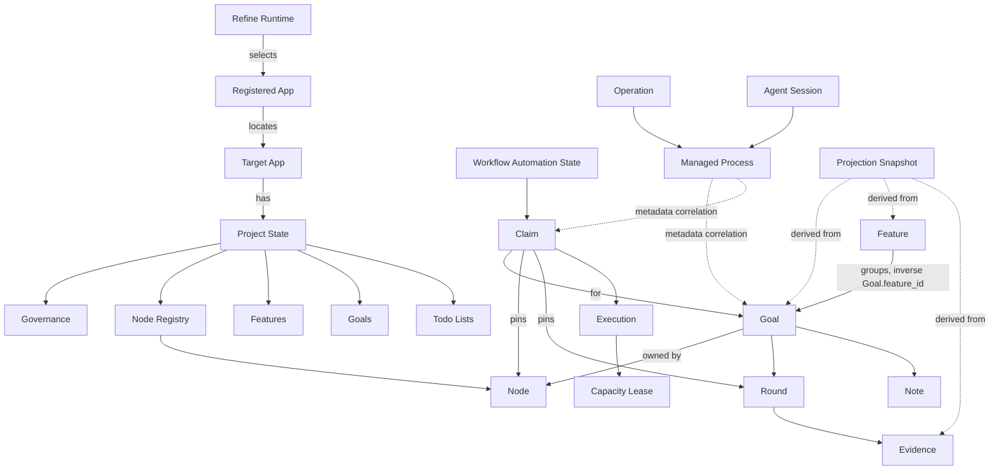

# Refine Ontology Package

This directory is the machine-readable companion to the
[as-implemented ontology reference](refine-ontology.md).

## Contents

- [`refine.ttl`](refine.ttl) — canonical RDF 1.1 / OWL 2 ontology in Turtle.
- [`entity-registry.csv`](entity-registry.csv) — flat class and vocabulary
  registry for spreadsheets, scripts, and catalog import.

The Turtle file is the canonical graph. The CSV is a convenience projection of
its entity inventory; relations, OWL restrictions, and status-transition edges
live only in `refine.ttl`.

## Authority

This package describes Refine; it does not control Refine.

```text
Operational authority
├── project-durable JSON/JSONL + refine/state
├── runtime claims, leases, operations, processes, and selection
└── target-app Git evidence

Documentation/interchange
└── docs/ontology/refine.ttl
    ├── classes
    ├── object and datatype properties
    ├── cardinality statements
    └── status/value vocabularies and transition edges
```

Refine's product/config/workflow services remain the mutation authority. OWL
uses open-world semantics, so absence of a triple does not mean Refine should
delete, default, or reject anything. The restrictions in the graph articulate
effective domain meaning; they are not SHACL validation rules and do not replace
code validation.

## Namespace

The ontology IRI is:

```text
https://github.com/buwilliams/refine/ontology
```

Terms use:

```text
https://github.com/buwilliams/refine/ontology#
```

Example:

```turtle
@prefix refine: <https://github.com/buwilliams/refine/ontology#> .

<urn:refine:goal:GOAL1>
    a refine:Goal ;
    refine:identifier "GOAL1" ;
    refine:ownedByNode <urn:refine:node:default> ;
    refine:hasStatus refine:statusReview ;
    refine:hasPriority refine:priorityHigh .
```

## Graph Overview



## Layers

| Layer | Meaning | Examples |
|---|---|---|
| `project-durable` | Git-backed target-app Refine state | Goal, Feature, Round, Node, Governance |
| `runtime` | Local operational authority | Claim, Execution, Lease, Operation, Managed Process |
| `derived` | Rebuildable view or observation | Projection Snapshot, Feature Rollup, Cluster View |
| `external` | System Refine operates but does not own as project state | Target App, Git Worktree |
| `conceptual` | Query superclass or semantic grouping only | Work Item, Evidence |
| `vocabulary` | Closed implemented wire values | Goal Status, Claim State, Quality Timing |

Every registered class has an `refine:authorityLayer` annotation directly or
through its superclass. `refine:codeReference`, `refine:persistencePath`, and
`refine:implementedAs` connect graph terms back to implementation evidence.

## Instance Identifier Convention

Refine does not currently emit RDF instances. A materializer should use stable
URNs and preserve the implemented identity rules:

| Entity | Recommended IRI |
|---|---|
| Node | `urn:refine:node:<node-id>` |
| Feature | `urn:refine:feature:<feature-id>` |
| Goal | `urn:refine:goal:<goal-id>` |
| Goal Round | `urn:refine:round:<goal-id>:<zero-based-round-index>` |
| Goal Note | `urn:refine:note:<goal-id>:<note-id>` |
| Reporter | `urn:refine:reporter:<registry-id>` |
| Todo List | `urn:refine:todo-list:<uuid>` |
| Todo Item | `urn:refine:todo-item:<uuid>` |
| Workflow Claim | `urn:refine:claim:<claim-id>` |
| Workflow Execution | `urn:refine:execution:<execution-id>` |
| Operation | `urn:refine:operation:<operation-id>` |
| Managed Process | `urn:refine:process:<process-id>` |
| Chat Session | `urn:refine:chat:<session-id>` |

Reporter and Assignee fields on work records remain denormalized names.
Materializers should emit `refine:reporterName` and `refine:assigneeName`.
They must not invent an object link to a Reporter registry record when a name
cannot be resolved uniquely.

## Transition Graph

Goal-status transitions are typed by authority:

- `refine:manualTransitionTo` — transitions accepted by the shared manual
  transition validator;
- `refine:promotionTransitionTo` — age-based Backlog promotion;
- `refine:automatedTransitionTo` — workflow-owned stage transitions and active
  failure paths;
- `refine:approvalTransitionTo` — human Review acceptance.

This separation prevents a graph consumer from mistaking the existence of a
status edge for permission to perform that transition from any surface.

## Example Queries

List the implemented Goal statuses and wire tokens:

```sparql
PREFIX refine: <https://github.com/buwilliams/refine/ontology#>

SELECT ?status ?token
WHERE {
  ?status a refine:GoalStatus ;
          refine:wireToken ?token .
}
ORDER BY ?token
```

List every automated Goal transition:

```sparql
PREFIX refine: <https://github.com/buwilliams/refine/ontology#>

SELECT ?fromToken ?toToken
WHERE {
  ?from refine:wireToken ?fromToken ;
        refine:automatedTransitionTo ?to .
  ?to refine:wireToken ?toToken .
}
ORDER BY ?fromToken ?toToken
```

Find the code and persistence mappings for durable classes:

```sparql
PREFIX refine: <https://github.com/buwilliams/refine/ontology#>
PREFIX rdfs: <http://www.w3.org/2000/01/rdf-schema#>

SELECT ?class ?label ?path ?code
WHERE {
  ?class rdfs:subClassOf+ refine:DurableProjectEntity ;
         rdfs:label ?label .
  OPTIONAL { ?class refine:persistencePath ?path }
  OPTIONAL { ?class refine:codeReference ?code }
}
ORDER BY ?label
```

## Maintenance

Update this package when a code change alters:

- a durable or runtime entity;
- an authority boundary;
- a cardinality or ownership rule;
- a wire vocabulary;
- an allowed Goal transition;
- a persistence path;
- a class/property code mapping.

The update sequence is:

1. revise the narrative reference if semantics changed;
2. update `refine.ttl`;
3. update `entity-registry.csv` for class/vocabulary changes;
4. parse the Turtle with an RDF parser;
5. compare Goal-status, Claim-state, Operation-state, Process-owner, Priority,
   and Quality-timing tokens against their Rust enums.
