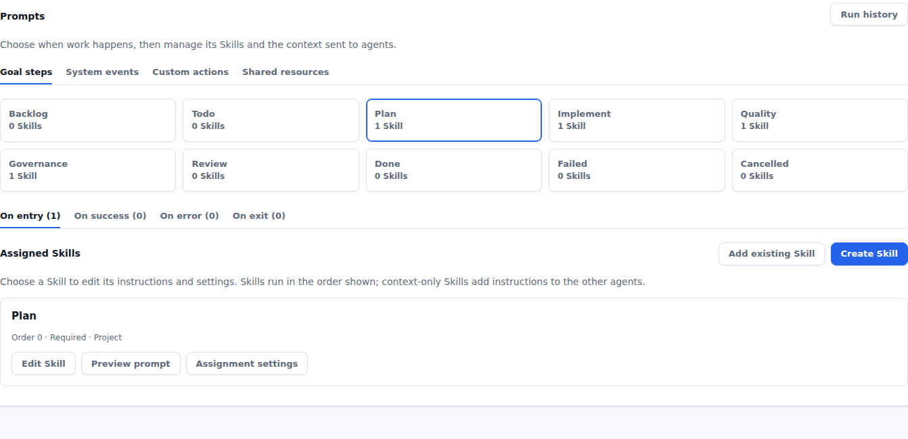

# Refine 4.3 — What you need to know

This release makes agent instructions visible and editable, brings related controls together, and helps you understand what agents receive.

## Make agent prompts your own

**Settings → Prompts** brings Skills, Templates, and shared context into one place. Edit instructions for each agent type and include reusable purpose and architecture guidance.

The agent-type map explains how the pieces fit together. Toolbar agents use Terminal sessions; Managed chat is an API launch path. [Learn about prompt customization](../product/prompts.md).

## Reuse Skills across your workflow

Attach an existing Skill to several Goal steps or system events. Each event can have several Skills. Counts on the event tabs show where Skills are assigned, and each card keeps its editing and preview controls together.

## Restore defaults when you need them

Reset a single Template from the resource list, or all Templates used by an agent type. The confirmation explains which shared Templates will change. Your Skills remain intact.

## Inspect the prompt an agent received

A Goal's **Prompts** tab lets you select a recorded launch and read the full retained prompt. Use it to understand how your Templates combined and improve future instructions. Older launches without retained prompts are clearly marked unavailable.

## Find controls in fewer places

The right navigation groups **Node**, **Reporter**, and **New Goal**. The New Goal menu also contains workflow and target-application status controls. **Settings** remains a dedicated main navigation item.

## Find documentation in Refine Hub

Refine Hub brings product guides, release notes, runbooks, and design intent together. It ships with Refine, works offline, and cannot be removed. Existing project hubs stay yours to manage. Help links now open the hub instead of a separate Guide panel.

No configuration changes are required to read the hub. Documentation source has moved into `refine-hub/`; update any personal scripts that read the old repository paths.
