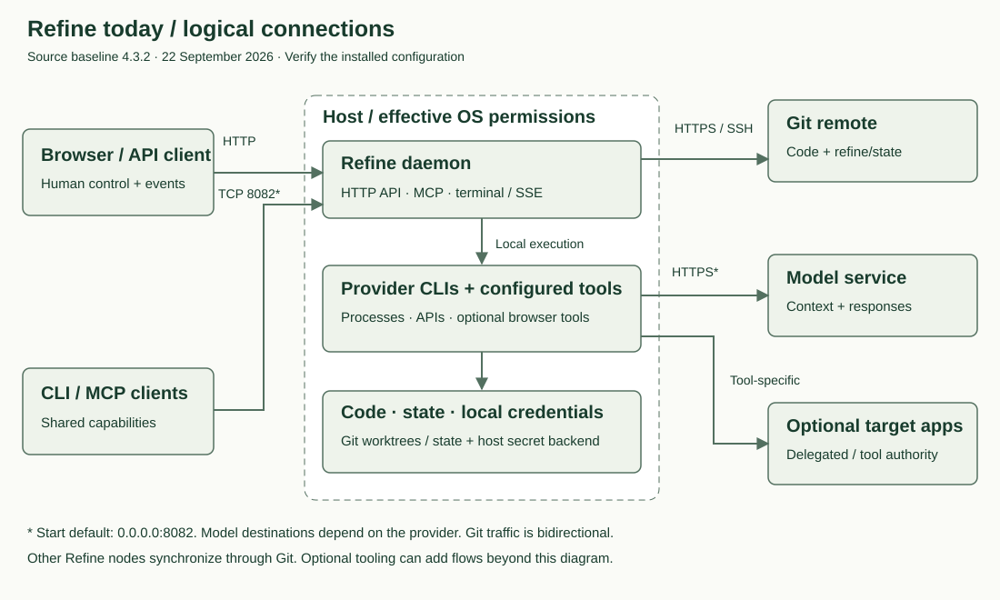
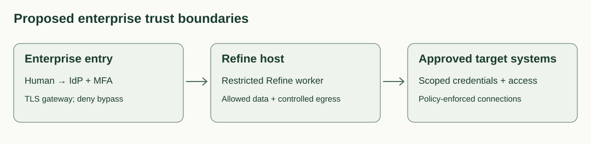

# Network diagram & trust boundaries

The diagrams describe logical flows, not a discovered enterprise network. Replace hostnames, ports, destinations, and enabled integrations with evidence from the deployment. Baseline: Refine 4.3.2, reviewed 22 September 2026.

## Current logical architecture

| Flow | Protocol / endpoint | Data and authority |
| --- | --- | --- |
| Browser / API client → daemon | HTTP; daemon start default TCP 8082 on `0.0.0.0`; configurable | Commands, Goals, files, terminal and event streams; native TLS/user authentication was not established in the reviewed transport |
| CLI / MCP → capabilities | Depends on configured local transport; HTTP MCP routes also exist | Access to shared Refine capabilities; inventory each entry point |
| Daemon → child processes | Local process execution | Provider CLIs and tools run with effective host/process authority |
| Node ↔ Git remote | HTTPS 443 or SSH, commonly 22; confirm remote config | Application code and shared state; repository credentials and membership control access |
| Provider CLI → model service | Usually HTTPS 443; confirm provider/proxy configuration | Prompts, selected context and outputs; retention and processing depend on contracted service |
| Tools → external systems | Tool-specific HTTP(S), SSH, APIs or browser connections | Optional flows, potentially with delegated user or workload sessions |

Fleet state synchronization through Git is shown; do not infer that every node requires direct network access to every other node. Inventory additional fleet/process integrations separately.

## Proposed enterprise arrangement

**Solid flows above are proposed controls, not features claimed to exist in Refine.** Users enter through an enterprise identity gateway with TLS and MFA. The Refine listener is reachable only from that gateway or is kept local to a dedicated workstation. Workers have a restricted identity and controlled egress. Downstream systems accept only the connections and actions permitted by the deployment policy.

For remote use, test gateway coverage of the entire control surface, including API, MCP, terminal/event streams, static assets, and Hubs. Block direct backend access. An authenticated gateway gives entry control; per-action authorization and application-level identity attribution still need a design and verification.

## Validate the diagram

The infrastructure owner records actual listener addresses, inbound rules, DNS names, proxy routes, TLS termination, Git remotes, model endpoints, tools and secrets backends. Test from an allowed client and a denied network. Capture egress during representative work with synthetic data and reconcile every destination with the allowlist.

Include logs, crash reports, backups, package registries, software updates, downloaded dependencies and optional integrations in the final data-flow inventory. Do not copy credentials into the diagram or evidence pack.

## Artifact, evidence and backup routes

Add worker/CI connections to the internal artifact service, its approved upstream registries, controlled publishing to the private release repository, and the authorized deployment path. Record actual endpoints, protocols, identities and data for each; HTTPS is the intended transport where supported. Deny direct package-download bypass. The [artifact flow](08-artifacts-and-providers.md) explains these proposed controls.

Also map host, gateway and target-system logs to the protected security log store, and state/configuration to the backup store. Restrict readers, encrypt transfers and verify retention and restore. Apply [provider contract review](07-intellectual-property.md) to external recipients, including model services and hosted repositories. These routes are deployment requirements, not built-in integrations claimed for Refine.
