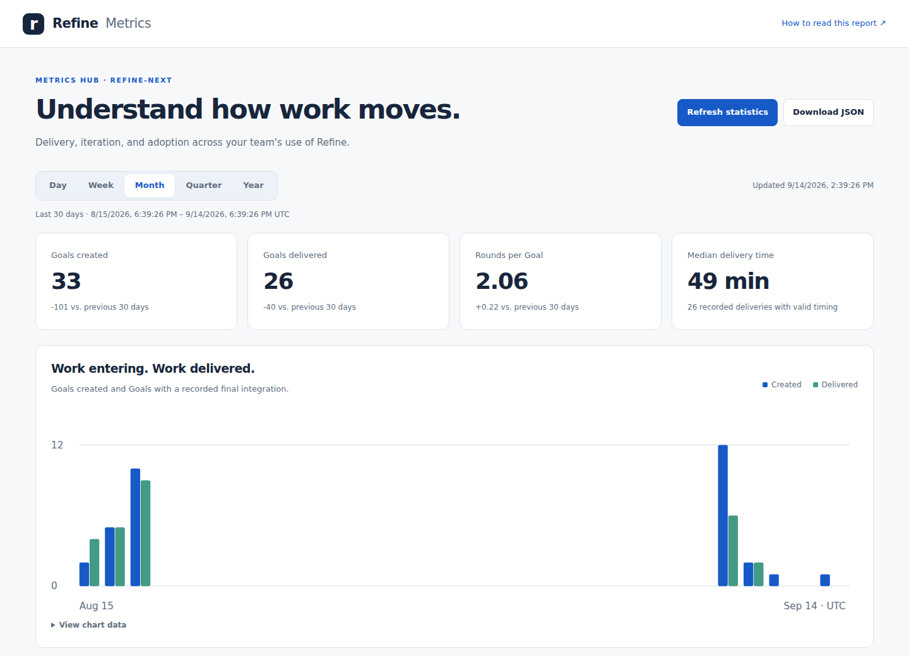

# Understand your use of Refine

**Metrics Hub** ships with Refine. Open it from **New Goal → Hub**, or from **Settings → Hubs**. It reports on the attached target app, including Goals received from other nodes through state synchronization.

## Start with a fresh snapshot

Choose **Refresh statistics** in Metrics Hub. Refine calculates and saves the report without launching an agent or changing Goals. The page shows its last refresh time and flags snapshots older than 24 hours. The saved aggregate synchronizes through refine-state; it contains no Goal prompts, reports, or source code.

You can also use `refine hub refresh-metrics`, or read the saved report with `refine hub metrics`. The API provides `GET /api/hub/metrics` and `POST /api/hub/metrics/refresh`; MCP exposes the same capabilities. Download JSON from the page to use the aggregate in another reporting tool.

## Choose a time horizon

Day, Week, Month, Quarter, and Year cover the last **24 hours, 7 days, 30 days, 90 days, and 365 days**. They are rolling windows, not calendar periods. Comparisons use the immediately preceding window of equal length. Chart dates use UTC. Trends use hourly buckets for Day, daily buckets for Week and Month, and weekly buckets for Quarter and Year. The final bucket may be shorter.

## Read the numbers

- **Goals created** measures new work entering Refine.
- **Goals delivered** counts currently Done Goals whose final Round has an integration timestamp within the window. Done Goals without that evidence remain in current workload totals, but are excluded from delivery trends and timing.
- **Rounds per Goal** averages all retained rounds on Goals created in the selected window. The distribution, multiple-round share, and single-round delivery share show how much iteration the work involves. More rounds can reflect learning or a changing Goal; they do not establish a defect rate.
- **Median delivery time** measures creation to recorded integration, including waiting. It is not agent execution time. The report shows how many deliveries have usable timing.
- **Rounds started** counts rounds created within the window, including rounds on older Goals.
- **Current workload** shows all retained Goals by their current status, with the age of unfinished work and how many unfinished Goals have gone seven days without an update. These totals do not change with the time selector.
- **Node activity** counts Goals updated in the window by current node assignment. **Reporter activity** counts newly created Goals by reporter. Neither measures human productivity or compute utilization.

The report is a snapshot of retained records, not a reconstruction of historical status. Deleted Goals and rounds are absent. Coverage notes identify missing dates. A refresh reads Goals individually while work continues; updates from another node appear after synchronization.

## Keep it maintained

The built-in **Update Metrics Hub** Skill runs the refresh command and reviews freshness, charts, and missing evidence. Run it manually from the New Goal menu or Settings → Hubs. To automate maintenance, attach the Skill to an appropriate event in Settings → Prompts, such as after a Goal finishes. It has no automatic event assignment by default.

Metrics Hub and its maintenance Skill cannot be removed. The Skill's instructions remain editable. A failed refresh leaves the previous saved report available.
