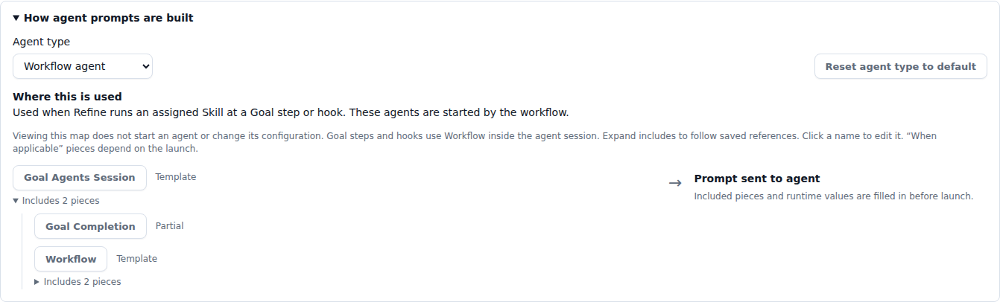
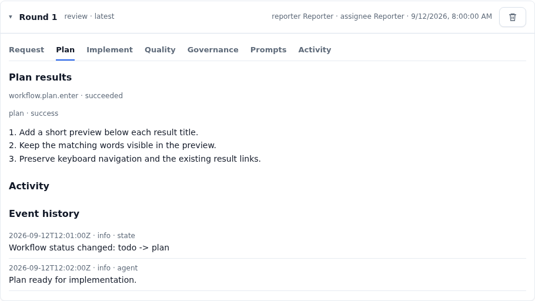
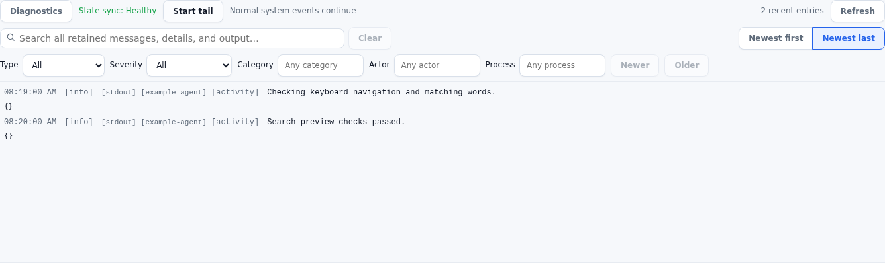
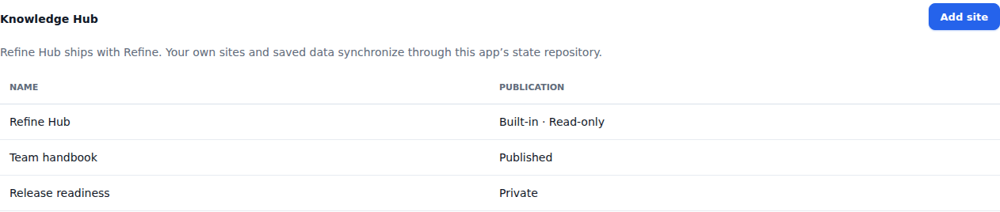

# Refine 4.3.1 — What you need to know

**Changes since September 2, 2026, through 4.3.1.** The 4.3 series brings agent instructions into one place, makes Goal progress and failures easier to follow, improves workflow recovery, and introduces Knowledge Hubs for documentation and reports.

The sections below describe the resulting product behavior. Small fixes and intermediate designs are grouped into the changes they support.

## Configure agent work through Skills

**Settings → Prompts** brings together the instructions used during Goal steps, system events, and custom actions. Skills replace the separate guidance, Quality, Governance, and development-automation settings.

A Skill describes the work, its desired outcome, and its guardrails. The workflow coordinates when it runs. **Quality handles testing and corrections; Governance verifies that the result meets the Goal, project purpose, and architecture.** You can adjust those instructions to suit your project.

Existing legacy configuration is migrated into Skills. If you previously customized those settings, review the resulting Skills here; editing the retired configuration files no longer changes the active setup. See [Configure Skills](../docs/runbooks/configure-skills.md).

## Reuse Skills wherever they are needed

Attach an existing Skill to several Goal steps or system events. Each event can have several Skills, with its own order and enabled state. A shared Skill's instructions are edited once and reused at each assignment.

Counts on **On entry**, **On success**, **On error**, and **On exit** show where Skills are attached. The selected Skill card keeps **Edit Skill**, **Preview prompt**, and assignment settings together. Custom-action cards include **Run Skill** and open an agent terminal when run on an eligible node.

## Make agent prompts your own

The **Shared resources** tab contains editable Templates and reusable context, including project purpose and architecture. Templates assemble the instructions sent to each agent type. Variables can include other Templates, and Refine expands nested variables before launch, including the actual path to the Refine executable.

The **How agent prompts are built** map lets you select an agent type and follow its included resources. It also explains where each launch path is used: toolbar agents use Terminal sessions; Managed chat is an API launch path.

Reset one Template from its resource row, or all Templates used by an agent type. The confirmation identifies shared Templates that will affect other agent types. Resets leave Skills unchanged. [Learn about prompt customization](../product/prompts.md).

## Follow a Goal one step at a time

Each Round now has flat tabs for **Request**, **Plan**, **Implement**, **Quality**, **Governance**, **Prompts**, and **Activity**. Open a step to see its recorded output and related activity together, without opening layers of nested panels. Recorded planning results are visible in the Plan tab.

The Activity view brings failure information forward and keeps the Round's history together. Tab selection is preserved as the Goal refreshes, and the tabs support keyboard navigation.

*Example Goal shown.*

## See the prompt an agent actually received

A Goal's **Prompts** tab lets you select a recorded launch and read the full retained Refine prompt, including expanded Template content. Use it to spot repeated instructions or missing context before adjusting your Templates.

Older launches without retained prompts are clearly marked unavailable. Provider instructions and later conversation messages are separate from the recorded Refine launch prompt.

## Keep control of the workflow

Goal workflow controls let you move work to another step and record decisions with context. Explicit overrides remain visible in history, and an older agent result cannot undo a newer workflow decision. When work is still running, Refine coordinates the change with that execution.

Marking a Goal Done through a forced status change does not itself merge code; candidate integration is a separate action.

Unwanted Rounds can be deleted with confirmation. **Deleting a Round stops current agent work, removes that Round's records, and returns the Goal to Backlog.** Choose the next step for the remaining work afterward.

## Find logs and diagnostics in the Toolbar

Open **System** from the Toolbar's add menu for system activity, synchronization health, and diagnostics. Open **View Logs** on a Goal for that Goal's output in a dedicated Toolbar tab.

Logs share search, type filters, matching-text highlights, and navigation to older results. Agent output is retained after execution settles, making it easier to investigate a completed or failed run. System log following is opt-in; ordinary notices and synchronization health still update while following is off.

*Example output shown.*

Recovery details and controls live with System diagnostics, giving you one place to investigate workflow or state-sync problems instead of scattering them across the Dashboard.

## Recover more reliably after interruptions

Workflow recovery now better distinguishes work that is still running, work waiting for capacity, and execution that has ended. Fixes address false stalled-worker reports, recovery delays that persisted after a worker handoff, and unfinished work left behind after interruption.

Refine also retains process-exit information across restarts, rebuilds generated workflow state from retained records, and recognizes already integrated work during recovery. Together, these changes reduce unnecessary retries and make workflow health more useful when diagnosing a stopped Goal.

## Copy and paste more predictably in agent terminals

Terminal, Agent, Planning Agent, Goal Agent, and Skill tabs now share consistent clipboard behavior. The **Copy selection** control retains selected text across output updates, tab changes, and process exit. If automatic copying is blocked, a selectable field lets you copy the captured text manually.

When an agent application captures mouse input, use **Shift-drag on Windows/Linux** or **Option-drag on macOS** to select text. With a selection, Ctrl+C copies; without one, it retains normal terminal interrupt behavior. Native browser copy and paste remain available.

Multiline paste reaches the originating session once, and a delayed paste is discarded if that session or focused tab changes. Alt+Up and Alt+Down also reach the focused agent application with their modifiers intact. See [Terminal behavior](../docs/intent/05-surfaces/03-browser/19-terminal.md).

## Create your own Knowledge Hubs

Use **Settings → Knowledge Hub** to create sites for a team handbook, reports, or other project knowledge. Upload website files and assets, manage collections of records, and preview a site before publishing it. The same capability is available to agents through the CLI, API, and MCP.

Publishing selects a saved version of the site's files and chosen read-only collections, so subsequent draft edits do not partially change the published site. Your authored content follows the project's state synchronization; query indexes can be rebuilt from those records.

*Example user-created sites shown.*

## Find product documentation in Refine Hub

**Refine Hub** is the permanent, read-only site for product guides, release notes, runbooks, design intent, and Refine's story. It ships with the executable, works offline, and updates with the installed version. Your own hubs remain editable and separate.

Help links now open this hub instead of the former Guide panel. The public website uses the same content, and existing documentation URLs continue to work.

Documentation source now lives in `src/surfaces/refine-hub/`. Update any personal scripts that read the old repository paths.

## Find everyday controls in fewer places

The right navigation now contains **Node**, **Reporter**, and **New Goal**. Node and Reporter use matching dropdowns that show both the selector label and current selection. **Settings** is a dedicated main navigation item, and node configuration is under **Settings → Nodes**.

The **New Goal** menu brings together creation actions, Knowledge Hub sites, and workflow and target-application status. Buttons beneath each status expose its available actions. Developer feedback is labeled **Contact Refine Devs**.

## If you import development requests from email

Email intake is configured through Skills, including manual or startup triggers, instead of separate development-automation settings. Imported Goals follow the ordinary workflow and manual Review controls; the retired email-specific Auto-approve setting is ignored.

Target selection and retry handling have also been tightened so repeated or concurrent intake does not create duplicate Goals. Review the [email intake runbook](../docs/runbooks/development-request-email.md) when updating an existing setup.
