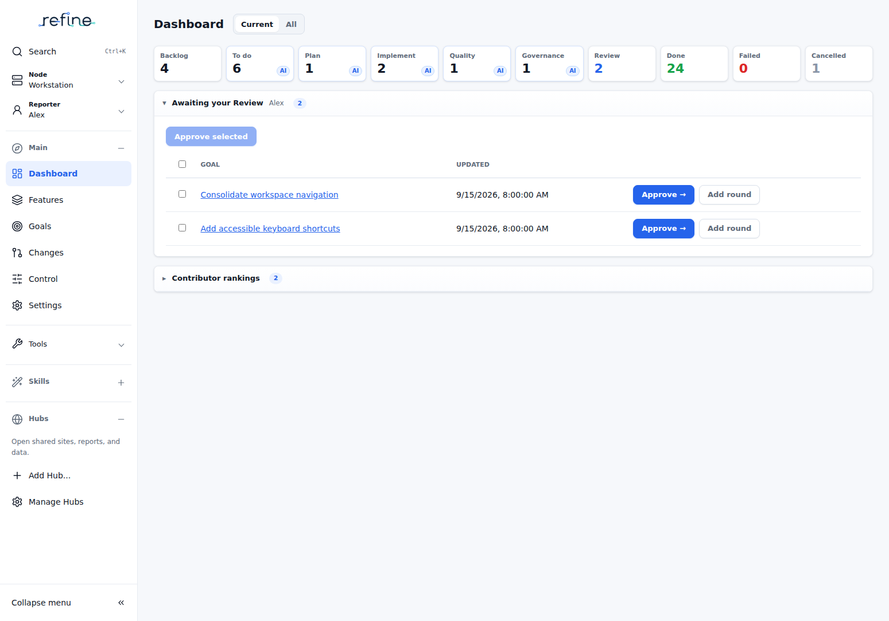
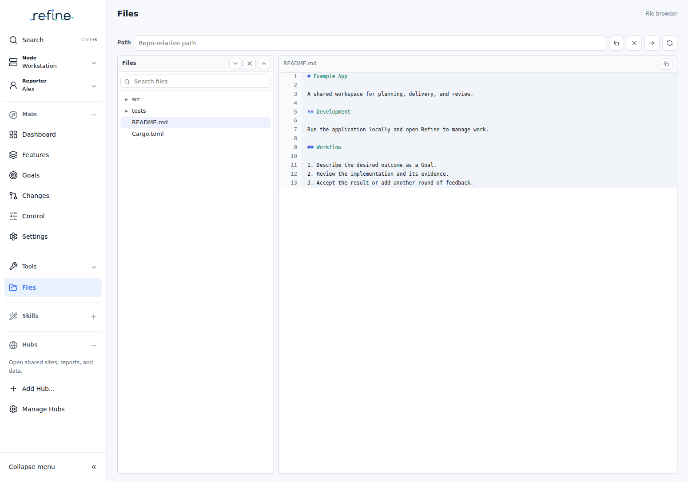

# Refine 4.3.2 — One place to navigate

Refine 4.3.2 consolidates global navigation and the former bottom toolbar into a collapsible left rail. Tools and agents now have the full height of the content area.

## Find your work in the left rail

The logo is centered in its own row. **Search**, **Node**, and **Reporter** stay together above the navigation sections:

- **Main:** Dashboard, Features, Goals, Changes, Control, and Settings.
- **Tools:** a dropdown to open tools, with existing windows always listed below it.
- **Skills:** enabled manual Skills, Add Skill, and Manage Skills.
- **Hubs:** Hub sites, Add Hub, and Manage Hubs.

Click anywhere on the Main, Skills, or Hubs header to expand or collapse that section. Click the Node or Reporter row to change its selection. The borderless “Collapse menu <<” control at the bottom collapses the rail to icons; “>>” expands it. On a small screen, the rail opens as a drawer. Your rail and section preferences survive reload.

*Screenshots use an example workspace to show the current interface without exposing live project data.*

## Give tools and agents room

**Tools** opens Agent, Agent in Worktree, System, Files, Todo List, Terminal, or Planning Agent. Goal-specific agent and log windows still open from the existing Goal actions. Todo List uses the full available width. Each window takes over the right content area; the bottom toolbar, resize handle, and toolbar fullscreen control are retired.

Switching screens keeps sessions running. Returning to the same underlying main screen preserves its controls and scroll position. Windows participate in browser Back/Forward, and a refresh restores explicitly opened windows and reattaches to their managed sessions.

Closing a running terminal or agent still asks Refine to stop its managed process. Its close action is labeled **Close and stop**. Hiding a section or changing screens never stops it.

## Search from any screen

Choose **Search**, press **Ctrl+K**, or use **⌘K** on Mac. The command palette works in terminals, agents, and dialogs as well as Main screens. Refine handles this shortcut before terminal input is sent. Escape closes Search and returns focus to the previous control.

## Find the relocated controls

**Control** is the main process-management screen, with icon actions for target app Build, Start/Stop, and status checks, workflow and worker controls, and daemon updates. Action names remain available to assistive technology and on hover. Old Processes links redirect to Control. Settings opens **Nodes**. **Settings → Workspace controls & support** contains the shared creation shortcuts, workflow and target-app quick actions, source update, appearance, and contact controls. Page creation actions and command-palette commands remain available.

Existing light and dark themes, workflow behavior, Goal attachment rules, and terminal lifecycle rules are retained.

## Email intake and startup Skills

Email intake can allow all senders at an exact domain with an entry such as `@example.org`. Matching remains case-insensitive and does not include subdomains or similarly named domains. Individual address entries still match only that address. See [email intake configuration](../docs/runbooks/development-request-email.md).

Startup Skill execution context now includes its invocation ID alongside the binding ID and role, allowing the Skill to identify the invocation that started it.

For the earlier 4.3 changes to Metrics Hub, Skills, prompts, Goal rounds, and recovery, see [Refine 4.3.1](4.3.1.md).
